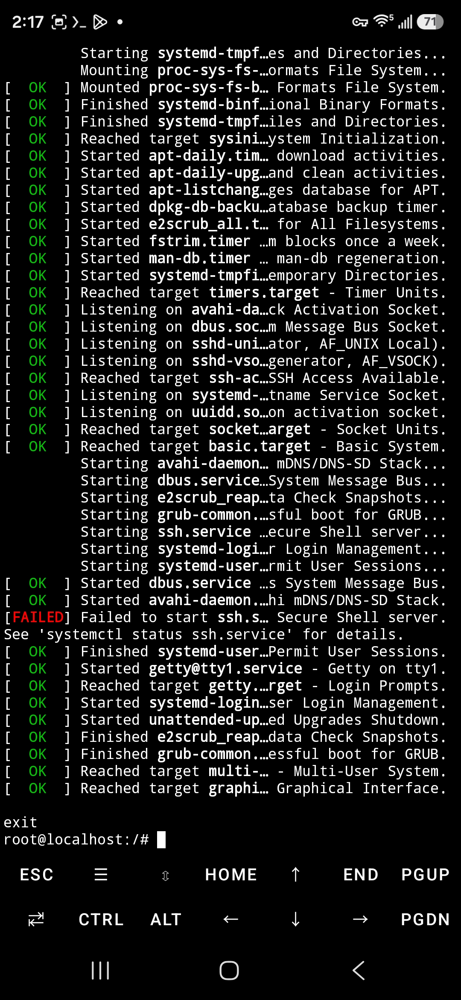

# S25U 成功安装原生 Linux

*[English version](README.en.md)*

在**锁 bootloader 的美版 Galaxy S25 Ultra（SM-S938U，骁龙 8 Elite）**上，跑起一个真正的
**Debian 13 (trixie) 虚拟机** —— 独立内核、systemd、root shell，不是 chroot 也不是 proot。



*Debian 13 在 SM-S938U 上完成启动 —— systemd 全绿、`multi-user.target` 达成、底部是 root shell。*

```
linuxvm: booting Debian 13  (2048 MiB, 2 vCPU) — 'poweroff' to exit
...
root@localhost:/# cat /etc/os-release | head -2
PRETTY_NAME="Debian GNU/Linux 13 (trixie)"
NAME="Debian GNU/Linux"
root@localhost:/# uname -r
6.12.63-android16-6-g8ee72b352c6a-ab14789739-4k
```

> **一句话原理**：系统自带的「Linux 终端」应用请求的是**非保护 VM**，被 TrustZone 里的
> Gunyah 固件拒绝，无解。但**受保护 VM 那条路固件是开放的** —— 用
> `crosvm --protected-vm-without-firmware` 走受保护通道、同时跳过 pvmfw 的签名校验，
> 任意内核就都能跑了。

---

## 目录

- [环境与前提](#环境与前提)
- [快速开始](#快速开始)
- [关键参数：四个缺一不可](#关键参数四个缺一不可)
- [为什么官方 Linux 终端永远跑不起来](#为什么官方-linux-终端永远跑不起来)
- [走不通的路（附证据）](docs/dead-ends.md)
- [关键日志证据](docs/evidence.md)
- [已知限制](#已知限制)
- [致谢](#致谢)

---

## 你真的需要这个吗？先看这张表

我自己折腾完之后的结论是：**这是"最像 Linux"的方案，但不是性能最好的方案。**
如果你的目标只是"在手机上用 Linux 工具链"，Termux 更快、更省事。

| 方案 | 本质 | 性能 | 原生程度 |
|---|---|---|---|
| **Termux** | Android 原生进程，bionic libc | **CPU 最快** —— 零虚拟化层 | 最低。不是 Linux，是 Android 用户空间：无 systemd、默认无 root、syscall 受 SELinux 限制 |
| **proot-distro** | 真发行版 rootfs，syscall 用 ptrace 模拟 | syscall 密集时慢 2~10 倍；纯计算接近原生 | 中。真 Debian 用户空间，内核仍是 Android 的 |
| **chroot**（需 root） | 真发行版 rootfs + 真 chroot | 接近原生，无 ptrace 开销 | 较高。真 Debian 用户空间 + Android 内核 |
| **本方案 / DroidVM** | **独立 Linux 内核** + 硬件虚拟化 | CPU 接近原生，但 **I/O 明显偏慢** | **最高** |

**VM 的三个固有代价**（都是本机实测）：

1. **所有 DMA 必须过 swiotlb 弹跳缓冲区** —— guest 内核日志显示它被调到只有 2 MB，
   磁盘和网络吞吐因此明显低于普通虚拟机。这是受保护 VM 的结构性开销，改不掉。
2. **内存是真切走的** —— 给 VM 2048 MB 就从手机里划走 2048 MB，不像 Termux/chroot 是共享的。
3. **碰不到硬件** —— VM 里看不见 USB 设备。想用 `termux-usb` 访问逻辑分析仪之类的，只能在 Termux 做。

**什么时候 VM 才值得**：需要跑 Docker/容器、加载内核模块、编译调试内核、要真正的隔离、
或者想跑别的内核甚至 Windows。除此之外，Termux（有 root 的话再加 chroot）几乎总是更优。

---

## 适用范围：不止这一台手机

方法本身跟机型无关，取决于**芯片的 hypervisor**。下载的镜像也是通用的
（`ferrochrome/aarch64/...`，没有机型标识），Terminal 应用是 mainline 模块，全设备同一份。

| 芯片 | 情况 |
|---|---|
| **骁龙 8 Elite** | ✅ 本方法适用。已验证：三星 S25 Ultra（本文）、联想 Y700 gen4（[原指南](https://github.com/polygraphene/gunyah-on-sd-guide)）、一加 13T（同款报错）。**小米 15 系列同为这颗芯片 —— 它们同样装着官方 Terminal 应用，也同样用不了**，见 [dead-ends 附录](docs/dead-ends.md) |
| 骁龙 8 Gen 2 / Gen 3 | ⚠️ `--protected-vm-without-firmware` 在这两代上不生效，需走 pvmfw 路线，见原指南的 [PVMFW.md](https://github.com/polygraphene/gunyah-on-sd-guide/blob/main/PVMFW.md) |
| 天玑 9400+ / Exynos / Pixel(Tensor) | 用不上本方法 —— 它们是 KVM/pKVM 系，官方 Terminal 应用本来就能用 |

**能解锁 bootloader 的机型（小米等）比本机更有优势**：可以装 Magisk/KernelSU 拿**永久 root**，
不像美版三星只能临时 root、一重启就失效。

需要的条件只有三个：骁龙 8 Elite、root、系统里有 `/dev/gunyah` 与 `com.android.virt` APEX。

---

## 环境与前提

本方案在以下环境验证通过（2026-09）：

| 项目 | 值 |
|---|---|
| 机型 | SM-S938U（Galaxy S25 Ultra 美版） |
| SoC | Snapdragon 8 Elite |
| 系统 | Android 16 / One UI 8.0，安全补丁 2026-01 |
| Bootloader | **锁定**（`ro.boot.flash.locked=1`，无 OEM 解锁开关） |
| Root | KernelSU 3.2.5（临时 root，SELinux 域 `u:r:ksu:s0`） |
| Hypervisor | Gunyah（`/sys/hypervisor/type` = `gunyah`，api 1 / variant 81） |
| 终端 | Termux |

**必须有 root。** 美版 S25U 的 bootloader 永久锁定、连 OEM 解锁开关都没有，所以只能用
临时 root 方案（KernelSU / APatch 等）。**重启后 root 失效，本方案也随之失效**，需重新获取 root。

不需要解锁 bootloader，不需要刷任何分区，不需要关闭 SELinux（全程 Enforcing）。

---

## 快速开始

### 1. 准备镜像

镜像来自 Google 的 ferrochrome 构建（就是官方「Linux 终端」下载的那份，约 500 MB 下载 / 解压后数 GB）。

**方式 A：从系统自带的 Linux 终端应用里取**（推荐，因为它会下最新版）

即使这个应用**跑不起来 VM**，它的下载功能是好的。用 Shizuku 或 root 启用它并让它下完：

```bash
# 启用应用（Samsung 在正式版 One UI 8 里移除了开发者选项中的开关）
su -c 'pm enable com.android.virtualization.terminal'
su -c 'settings put global linux_terminal_available 1'
su -c 'am start -n com.android.virtualization.terminal/.MainActivity'
# 在手机上点「安装」，等它下完（会显示"需要下载约 525 MB 的数据"）
```

下完后镜像在 `/data/user/0/com.android.virtualization.terminal/files/linux/`。

**方式 B：直接从 Google 下载**

```bash
curl -LO https://dl.google.com/android/ferrochrome/3500000/aarch64/images.tar.gz
tar xf images.tar.gz     # 得到 root_part、vmlinuz 等
```

### 2. 安装

```bash
git clone https://github.com/roobtx/s25u-native-linux
cd s25u-native-linux
bash setup.sh            # 复制镜像到 /data/local/tmp/linuxvm 并安装 linuxvm 命令
```

`setup.sh` 会自动从 Terminal 应用的目录取镜像（保留稀疏文件，实占约 1.6 GB）。

### 3. 启动

```bash
linuxvm
```

直接落到 root shell。VM 内 `poweroff` 干净退出。

```bash
LINUXVM_MEM=2048 LINUXVM_CPUS=2 linuxvm    # 可调，但见「已知限制」
```

---

## 关键参数：四个缺一不可

这四个是整个方案的核心，任何一个缺了都会以完全不同的方式失败。**每一个都是踩坑换来的。**

### 1. `--protected-vm-without-firmware`

**这是唯一的钥匙。** 走受保护 VM 通道（固件允许的那条），但跳过 pvmfw 的 AVB 签名校验。

不加 → 变成非保护 VM → TrustZone 直接拒绝（见 [dead-ends](docs/dead-ends.md)）。
加了但用 `--protected-vm-with-firmware` → pvmfw 会要求内核带 AVB 签名，Debian 内核没有 → `Failed to verify the payload: Invalid metadata`。

### 2. `ulimit -l unlimited`

内核的 `account_locked_vm` 默认只允许 64 KB 锁定内存，crosvm 需要锁住整个 guest 内存。

不加 →
```
failed to initialize virtual machine Out of memory (os error 12)
dmesg: Failed to allocate parcel for DTB: -12
```

### 3. `8250.nr_uarts=4`（内核参数）

ferrochrome 的内核**默认不创建 `/dev/ttyS*` 设备节点**（`CONFIG_SERIAL_8250_RUNTIME_UARTS=0`）。
内核自己的 printk 能输出到串口，但 userspace 打不开 `/dev/ttyS0`。

不加 → 内核日志正常刷屏，但：
```
debug-shell.service: Failed to set up standard input: No such file or directory
debug-shell.service: Failed at step STDIN spawning /usr/bin/bash: No such file or directory
```

### 4. `systemd.mask=serial-getty@ttyS0.service`（内核参数）

**这是稳定性的关键，也是我卡最久的一个坑。**

不加的话，`serial-getty` 和 `systemd.debug_shell` 会**同时抢 ttyS0**。日志里会刷一串
终端探测转义序列 `[6n` `[32766;32766H`，然后 crosvm 崩溃：

```
WARN  hypervisor::gunyah] unknown gh exit reason: 3
ERROR crosvm::sys::linux::vcpu] vcpu hit unknown error: Invalid argument (os error 22)
```

`gh exit reason 3` 是 Gunyah 的 `GUNYAH_VCPU_EXIT_PAGE_FAULT`，crosvm 没实现处理就直接死。

**这个崩溃极具误导性** —— 它长得像内存不足。屏蔽 getty 能显著改善，但**它不是全部原因**，
见下面第 5 条。

### 5. 启动前整理宿主内存（最关键，也最反直觉）

**没有这一步，失败率接近 100%。** 我最初只做了前四条，跑出一次 125 秒零崩溃就下了"稳定"的结论；
重复测试才发现是 **0/5**。

根因是**宿主内存碎片**。受保护 VM 需要大块连续物理内存，而手机用几小时后高阶内存块会耗尽：

```
整理前 /proc/buddyinfo：45304 29391 13255  2394   219    45     0    0   0  0   0
                                                              ↑ order 6 以上全是 0
整理后：                80388 41397 20945  9304  2924  1738   694  273  61  0  74
```

**最好的解法：装 [GH-Hugepage-Reserve](https://github.com/Droid-VM/gh-hugepage-reserve) 内核模块。**

它挂钩 `__alloc_pages`、监视 Gunyah 的 VM 创建，直接从预留的 2 MiB 大页池供给内存 ——
正是为这个问题而生的。内核日志一目了然：

```
gh_hugepage_reserve: hooked __alloc_pages
gh_hugepage_reserve: watching for VM creation (gunyah_dev_vm_mgr_ioctl)
gh_hugepage_reserve: pool ready: N x 2MB (target 1024)
```

实测**只靠它就 4/4 干净启动**，完全不需要清缓存。模块自带 ABI 预检（比对运行内核的 BTF 符号签名），
本机 7 个符号全部匹配。它随 [DroidVM](https://github.com/Droid-VM/DroidVM) 一起分发，
也可以单独装（KernelSU/Magisk 模块）。

**退而求其次**（没装模块时），启动前手动整理：

```bash
sync
echo 3 > /proc/sys/vm/drop_caches
echo 1 > /proc/sys/vm/compact_memory
```

再配合 crosvm 的 `--hugepages`。这样也能 **0/5 → 5/5**，但代价是清空全系统页缓存，
其他 App 会卡一阵。`linuxvm` 会自动检测模块：有就用模块，没有才退回这个办法。

> 这也是为什么有人在一加 13T（同为骁龙 8 Elite）上遇到一模一样的报错后
> [放弃了](https://github.com/lfdevs/run-linux-on-android-guide/discussions/1) —— 他也怀疑是内存，
> 但没找到"整理碎片"这一步。

---

## 为什么官方 Linux 终端永远跑不起来

这台机器上，AVF（Android Virtualization Framework）是**三层套娃**：

| 层 | 现象 | root 能否解决 |
|---|---|---|
| ① Android 框架门禁 | `UnsupportedOperationException: Non-protected VMs are not supported on this device` | ✅ 能（`resetprop ro.boot.hypervisor.vm.supported true`） |
| ② crosvm 中断注册 | `failed to register irq fd: File exists` | ⚠️ 减少设备可绕过 |
| ③ TrustZone 固件否决 | `RM rejected message 56000004. Error: 2` → `Failed to start VM: -19` | ❌ **不能** |

第 ③ 层是签名的 TrustZone 固件在裁决：`0x56000004` 是 Gunyah RM 的 `VM_START` RPC，
`Error: 2` 是 `GUNYAH_RM_ERROR_NORESOURCE`。**这台机器的固件不为非保护 VM 提供资源。**

而 Terminal 应用的配置里写死了 `"protected": false`，所以它永远撞在第 ③ 层。

**但受保护 VM 是完全可用的** —— 对照实验：`vm run-microdroid --protected` 能完整启动、
运行负载、干净关机，内核零错误。整套 crosvm / Gunyah 驱动 / TZ RM 通路都是好的。

于是路就清楚了：**走受保护通道，但别让 pvmfw 检查签名。**

---

## 相关项目：DroidVM

做到这一步之后我才发现 [Droid-VM/DroidVM](https://github.com/Droid-VM/DroidVM)（GPL-3.0，
活跃开发中）—— 一个带图形界面的 Android 虚拟机管理器，把本仓库还缺的东西都做了：

- **桌面图标入口**，不用开 Termux 敲命令
- **虚拟网络**：自带虚拟交换机 `gvswitch` + `bridgedhcp`，NAT / DHCP / IPv4+IPv6
- **图形显示**：VirGL / GfxStream / 2D 渲染 + 内置 VNC 客户端
- 同一个组织还维护 [修改版 crosvm](https://github.com/Droid-VM/crosvm)、
  [Gunyah 的 UEFI 固件](https://github.com/Droid-VM/edk2-gunyah)、
  [Windows 半虚拟化驱动](https://github.com/Droid-VM/gunyah-guest-drivers-windows)
- 正确识别本机：Gunyah ✓ / KVM ✗ / GenieZone ✗，SoC 显示 Qualcomm Snapdragon 8 Elite

它同样用系统自带的 `/apex/com.android.virt/bin/crosvm`，配置存成 `vms.json` / `disks.json` /
`networks.json`（设置里可导入导出）。

**本仓库的价值在于把原理和坑讲清楚**；想要开箱即用的图形化方案，直接上 DroidVM。
上面那个大页模块就是从它那里发现的。

---

## 已知限制

- **root 是前提**。重启即失效，需重新获取。
- **稳定配置是 `--mem 2048 --cpus 2`**，前提是做了上面第 5 条的内存整理。4096 MiB 即使整理过内存
  仍会崩（实测 2/2 失败），所以 2048 是目前的上限。[原始指南](https://github.com/polygraphene/gunyah-on-sd-guide)
  的作者在 Lenovo Y700 gen4 上用 4096/4 是稳的，可能与机型/固件有关，值得自己试。
- **目前只有串口控制台**，没有图形界面、没有网络。网络需要 tap 设备（AVF 用 `vmnic`），
  图形需要 virtio-gpu + 显示后端，都还没搭。
- **三星的后台管理**可能在你切走 Termux 时冻结进程 —— 建议保持 Termux 前台，或在电池设置里
  给它免优化。（注意：VM 的崩溃**不是**被 Android 的 LMK 杀掉的，logcat 里没有任何
  lmkd 记录，见 dead-ends。）
- 磁盘是 `--rwdisk`，**会真实写入镜像**。想保留干净副本请自己先备份 `root_part`。

---

## 文件说明

| 文件 | 用途 |
|---|---|
| `linuxvm` | 启动脚本，装到 `~/.local/bin/` |
| `setup.sh` | 准备镜像 + 安装脚本 |
| `docs/dead-ends.md` | **所有走不通的路**，附完整报错，省得你重走 |
| `docs/evidence.md` | 关键日志/strace 证据原文 |
| `README.en.md`, `docs/*.en.md` | 以上三份的英文版 |
| `posts/hackaday.md` | Hackaday.io 风格的项目帖（英文） |
| `posts/xda.md` | XDA 论坛风格的帖子（英文） |

---

## 致谢

- [polygraphene/gunyah-on-sd-guide](https://github.com/polygraphene/gunyah-on-sd-guide) —
  在骁龙 8 Elite 上验证了 `--protected-vm-without-firmware` + `ulimit -l unlimited` 这套组合。
  没有这份资料我不会想到往受保护 VM 那边试。
- Google ferrochrome / AVF 团队 —— 镜像和 crosvm 都来自系统自带的 `com.android.virt` APEX。

## License

MIT（脚本与文档）。镜像与 crosvm 属各自版权方，本仓库不分发。
